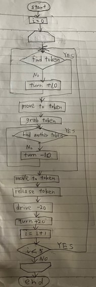

# RT1_assignment1_Mezawa
This is my codes which control the robot to put all the golden boxes together  
	This code can be run with:

 ```bash
$ python run.py assignment.py 
``` 

## flowchart
The flowchart of this codes is shown as follows:




## There are three things I did in this code

・I made it possible for the robot to find other tokens without detecting the token the robot already grabs.

・I made sure that the robot does not detect tokens that it has already collected.

・I made use of functions so that the same code is not repeated.

## There are two issues to be addressed in the future.

・To make it possible to detect the number of markers to be collected.

・The collected tokens are a little wide, so we would like to be able to collect tokens in a more uniform manner.

